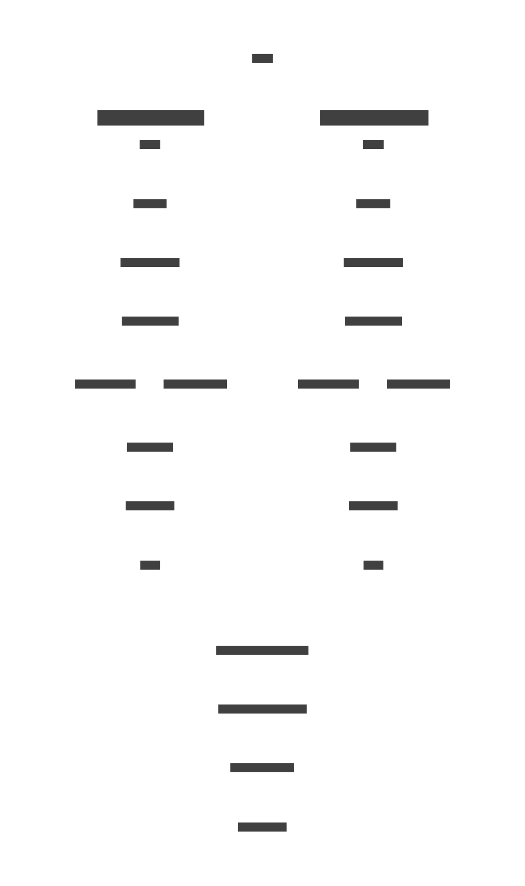

# Algorithm

This section describes how the algorithm works.

## Process

First, the audio signal is duplicated, we first filter it to only keep the sub frequency band (0 - 60Hz), then we split the signal into blocks (by default of 1024 samples).
After that we compute the energy of each block using the following formula:
$$ E_x = \sum_{n=0}^{K} x_n^2$$
Where:
- $K$ Is the number of samples in the block (by default 1024).
- $E_x$ Is the energy of the block ($x$ is the block).
- $x_n$ Is the $n^{th}$ sample of the block.

The energy is the sum of the square of each sample of the block.

Then we compute the average energy of the signal. The energy is averaged over a window (by default 43 blocks). The formula is as follows:
$$ \bar{E_x} = \frac{1}{N} \sum_{n=x}^{x + N} E_{x + n}$$
Where:
- $N$ is the number of blocks in the window (by default 43).
- $E(x_n)$ is the energy of the $n^{th}$ block.
- $\bar{E_x}$ is the average energy of the $x^{th}$ block.

After that we compute the variance of the signal, in other world how much the signal changed since the previous block.
Any negative value is set to 0.
$$ V_x = \max{(0, E_{x} - E_{x - 1})}$$
Where:
- $V_x$ is the variance of the $x^{th}$ block.
- $E_x$ is the energy of the $x^{th}$ block.
- $E_{x - 1}$ is the energy of the previous block.

Then we can check wether a block contains a beat. This is done by checking if the variance is greater than the average.

After this, the beats are _filtered_ to remove any beats that would be too close to each others (based on the given max_bpm, by default 400).

Then, the process is repeated for the low frequency band (60 - 200Hz) and the beats are merged (with a weight of 2.0 for the sub frequency band and 1.0 for the low frequency band).

Finally, the beats are _filtered_ again to remove any beats that would be too close to each others (based on the given max_bpm, by default 400) and using the weight (if a beat from the sub frequency band is too close to a beat from the low frequency band, the beat from the sub frequency band will be kept).

## Disclaimer
This algorithm isn't perfect and only works if the song contains a clear beat. It will not work for songs that don't have a clear beat.

I believe the algorithm can be improved by also using the beats from the high midrange frequency band, by adding the filtered signals together with attenuations and amplification (to mainly focus on the sub frequencies).

Additionally, the bpm that you can calculate from the beats won't match the one you can find online. A potential way to get the bpm would be to compute the time difference between each beat (discarding the 1st one), and filter out the outliers (the beats that are too far or too close from the average). Then you can compute the bpm from the average time difference.\
**Note:** This is just a theory, I haven't tested it yet.